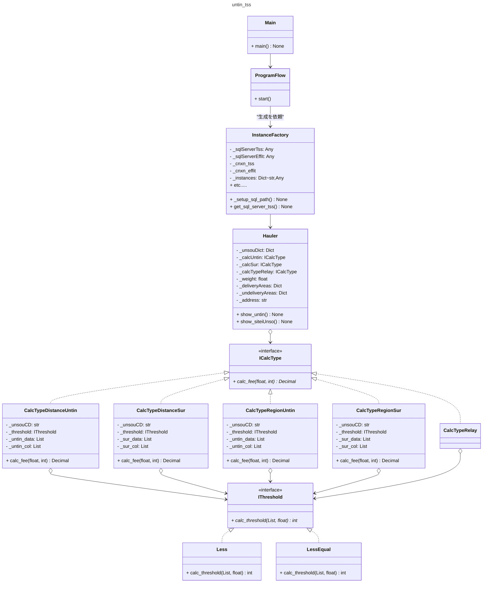
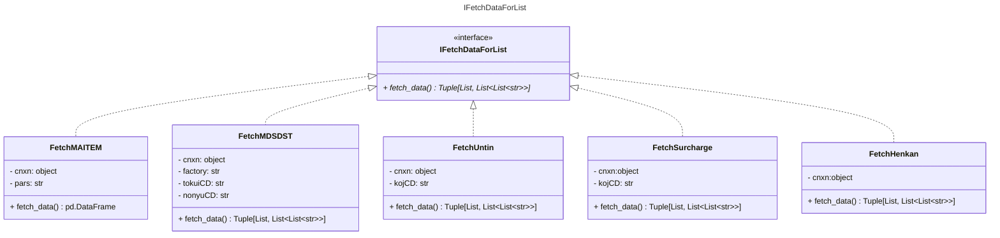

# untin_tssについて
## システム概要
### 動作環境
- OS  
    - Windows11(main.py)
    - Ubuntu WSL2(untin_tss.py)
- インストール先
    - 尾頭PC WSL2(Ubuntu)で開発
### 構築システム
- メインシステム: Python3.10
### ソースコード
GitHub Publicリポジトリで公開 
[GitHub_ https://github.com/ogashira/untin_tss](https://github.com/ogashira/untin_tss)
### 起動方法
##### tss_syukka
- `Winボタン+R -> untin 入力 -> Enter`または`cmdにて、 pushd \\wsl$\Ubuntu\home\oga\projects\tss_syukka\`デイレクトリ内にて`python main.py`で実行
### 使用方法
1. [win]+R -> untin -> Return
1. 出荷工場を選択
1. 得意先名または住所の一部を入力
1. 納入先の番号を選択
1. 重量(kg)を入力
1. 各運送屋の運賃、追加料金、顧客指定の運送屋が表示される。
    
### クラス

| クラス名              | interface         | 仕事 |
| :---:                 | :---:             | :--- |
| program_flow          |                   | def start() プログラムの流れ    |
| UserInterface         |                   | ユーザの入力を受け付ける。 |
| InstanceFactory       |                   | インスタンスを作る |
| FetchMAITEM           | IFetchDataForList | 得意先名、住所のデータをfetch |
| FetchMDSDST           | IFetchDataForList | 得意先の距離、中継などのデータをfetch |
| FetchUntin            | IFetchDataForList | 運送屋の基本運賃表表データをfetch |
| FetchSurcharge        | IFetchDataForList | 運送屋のサーチャージデータをfetch |
| FetchRelay            | IFetchDataForList | 運送屋の中継料データをfetch |
| FetchHenkan           | IFetchDataForList | 奈良広島行く行かないデータをfetch |
| Hauler.py             |                   | 運送屋のインスタンス運賃計算を行い、結果を表示する。
| CalcTypeDistanceUntin | ICalcType         | 運賃の計算方法が距離タイプのインスタンス。
| CalcTypeDistanceSur   | ICalcType         | サーチャージの計算方法が距離タイプのインスタンス。
| CalcTypeRegionUntin   | ICalcType         | 運賃の計算方法が地域タイプのインスタンス。
| CalcTypeRegionSur     | ICalcType         | サーチャージの計算方法が地域タイプのインスタンス。
| CalcTypeRelay         | ICalcType         | 中継料の計算方法のインスタンス。
| LessEqual             | IThreshold        | 運賃表の重量閾値が以下の閾値を返すインスタンス
| Less                  | IThreshold        | 運賃表の重量閾値が未満の閾値を返すインスタンス(ケイヒン)
| CreateDictFromList    |                   | さまざまなListからDictを作る道具 |
| FilterForMaxSttDay    |                   | 適用開始日を絞ったデータを作る。sttDay今日よりも前で最新のデータに絞る |
| TextAlign             |                   | 全角／半角が混在するテキストを指定の長さ(半角換算)になるように空白などで埋める道具 |
| GetIdx                |                   | カラムのリストとカラム名からインデックスNoを得る道具。StaticMethod |
| Recorder              |                   | 文字列を渡して、標準出力とファイルに書き込んでもらう道具。|

### クラス図

